# Hi there, I'm Ngari Peter Ndung'u 👋

## 🚀 About Me

I'm a passionate full-stack developer transitioning into the world of Web3. I love building smart contracts and exploring the potential of decentralized applications.

---

### 🛠️ Skills & Technologies

---

### 🌱 I'm Currently Learning

*   Advanced Smart Contract Development (Foundry, Hardhat)
*   Layer 2 Scaling Solutions (Optimism, Arbitrum)
*   DeFi Concepts (Liquidity Pools, Yield Farming)
*   Web3 Frontend Libraries (Ethers.js, Web3.js)

---

### 📫 How to Reach Me

---

### 📊 GitHub Stats

---

### My Contributions

<!--
**NgaripeterN/NgaripeterN** is a ✨ _special_ ✨ repository because its `README.md` (this file) appears on your GitHub profile.
-->
